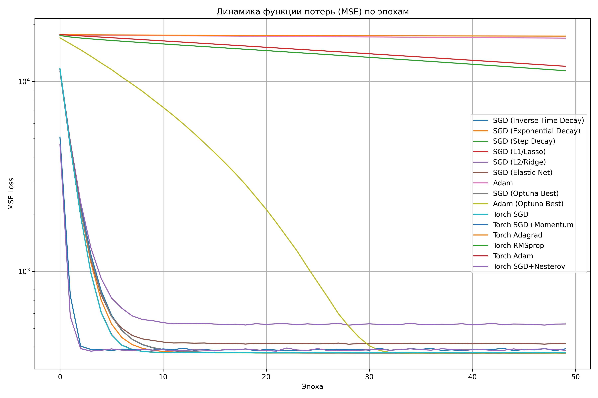
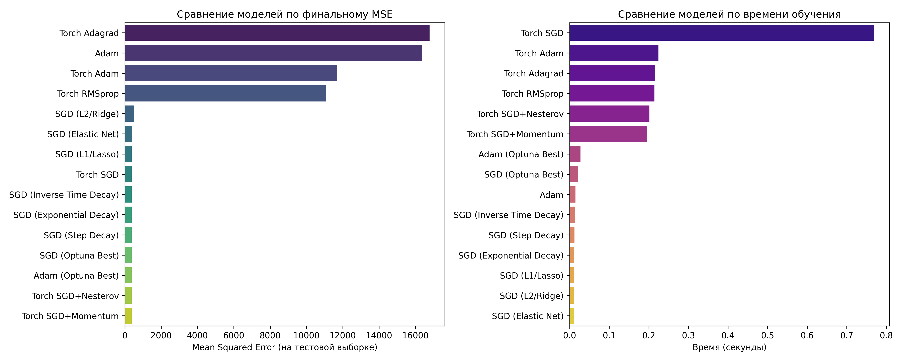

# Отчет о лабораторной работе №3

## 1. Постановка задачи

Реализовать и исследовать на эффективность метод стохастического градиентного спуска (SGD) и его модификации для решения задачи многомерной линейной регрессии.

1.  Сравнить эффективность SGD при использовании различных размеров батча (batch size).
2.  Исследовать влияние различных стратегий изменения скорости обучения (learning rate scheduling) и методов регуляризации (L1, L2, Elastic Net).
3.  Сравнить производительность собственной реализации SGD с библиотечными оптимизаторами из `PyTorch` (SGD, Momentum, Nesterov, Adagrad, RMSProp, Adam).
4.  Проанализировать самописную модификацию SGD (adam)
5.  Использовать инструмент автоматического подбора гиперпараметров `Optuna` для поиска оптимальных конфигураций моделей и сравнить их с базовыми вариантами.

В качестве объекта исследования использовался синтетический набор данных, сгенерированный с помощью функции `sklearn.datasets.make_regression`.

## 2. Описание используемых методов

### 2.1. Самописные методы

-   `SGDRegressorManual`:  реализация стохастического градиентного спуска.
    -   Ключевые гиперпараметры: `learning_rate`, `n_epochs`, `batch_size`, коэффициенты L1 (`l1_reg`) и L2 (`l2_reg`) регуляризации.
    -   Особенности: Реализована поддержка различных стратегий изменения скорости обучения: постоянный шаг, экспоненциальное, ступенчатое затухание.
    -   Преимущества: Простота реализации, низкие требования к памяти, возможность вырваться из локальных минимумов за счет стохастичности.
    -   Недостатки: Высокая чувствительность к выбору скорости обучения, медленная сходимость из-за шумных обновлений градиента.
    

-   `AdamManual`: Собственная реализация адаптивного оптимизатора Adam.
    -   Ключевые гиперпараметры: `learning_rate`, `n_epochs`, `batch_size`, коэффициенты затухания для моментов `beta1` и `beta2`, `epsilon`.
    -   Преимущества: Адаптивная скорость обучения для каждого параметра, что часто ускоряет сходимость; сочетает идеи Momentum и RMSProp.
    -   Недостатки: Более сложен в реализации, требует больше памяти для хранения моментов, может быть чувствителен к гиперпараметрам (как показало исследование).

### 2.2. Библиотечные методы

-   Использовался стандартный модуль `torch.optim` для сравнения с кастомными реализациями. Протестированы следующие оптимизаторы: `SGD`, `SGD` с `Momentum` и `Nesterov`, `Adagrad`, `RMSProp` и `Adam`.
    -   Преимущества: Готовые, хорошо протестированные и оптимизированные реализации; широкий выбор алгоритмов; простая интеграция.
    -   Недостатки: Работают как черный ящик

Перебор: `Optuna` Использовалась для поиска оптимальных комбинаций гиперпараметров для `SGDRegressorManual` и `AdamManual` путем минимизации среднеквадратичной ошибки (MSE) на кросс-валидации.

## 3. Результаты исследования

Все эксперименты проводились на сгенерированном наборе данных (1000 семплов, 10 признаков). Данные были разделены на обучающую (80%) и тестовую (20%) выборки и масштабированы с помощью `StandardScaler`.

### 3.1. Исследование эффективности SGD

#### Влияние размера батча

Анализ данных из `results/optuna_sgd_study.csv` показывает, что для данной задачи наилучшие результаты (наименьшее значение MSE) достигались при использовании маленького размера батча (`batch_size=16`). Из 50 запусков `Optuna` для SGD, все 10 лучших результатов были получены с `batch_size=16`. Это говорит о том, что более частое обновление весов на небольших порциях данных способствует лучшей сходимости модели. Более крупные батчи (64, 128) систематически показывали худшие результаты.

#### Влияние стратегий изменения шага (LR Schedulers)

Как видно на графике `results/lr_strategies_comparison.png` и в итоговой таблице, все реализованные shedulers (ступенчатый, экспоненциальный) показали очень близкие и высокие результаты, незначительно превзойдя модель с постоянным шагом.

#### Влияние регуляризации

-   L1 (Lasso): Показала хороший результат, незначительно уступив моделям с планировщиками.
-   L2 (Ridge): Продемонстрировала худший результат среди всех вариаций SGD. Вероятно, подобранный вручную коэффициент `0.1` оказался слишком велик, что привело к недообучению (underfitting).
-   Elastic Net: Комбинация L1 и L2 показала средний результат.

### 3.2. Сравнение модификаций SGD и библиотечных методов

-   Самописный Adam vs Torch Adam: 
- Самописный `Adam` с параметрами по умолчанию показал очень плохой результат
- `Torch Adam` (также с параметрами по умолчанию) выступил ненамного лучше.
-   SGD с Momentum/Nesterov: Библиотечные реализации `SGD` с моментом (особенно `Momentum` и `Nesterov`) показали одни из лучших результатов по точности, уступив лишь оптимизированному `Adam`. Это доказывает эффективность накопления импульса для ускорения сходимости в правильном направлении.
-   Adagrad и RMSProp: В данной задаче показали себя хуже других адаптивных методов.
-   Скорость: Собственные реализации оказались значительно быстрее библиотечных. Это ожидаемо, так как в `PyTorch` происходят дополнительные операции для построения графа вычислений и например работы с тензорами

### 3.3. Эффективность подбора гиперпараметров с `Optuna`

Использование `Optuna` дало значительный прирост производительности, особенно для модели `Adam`.

-   `Adam (Optuna Best)` стал лидером по точности (MSE = 379.49), превзойдя все остальные модели. Это  демонстрирует, как важен подбор гиперпараметров 
-   `SGD (Optuna Best)` также показал отличный результат

Лучшие найденные параметры:

-   Для SGD: `{'learning_rate': 0.0052, 'l1_reg': 0.0048, 'l2_reg': 0.0001, 'batch_size': 16, 'scheduler_type': 'inverse', 'decay_rate': 0.122}`.
    -   *Вывод*: Optuna предпочла маленький `batch_size`, невысокую скорость обучения с `inverse` планировщиком и слабую L1/L2 регуляризацию.
-   Для Adam: `{'learning_rate': 0.05, 'beta1': 0.97, 'beta2': 0.92, 'batch_size': 16}`.
    -   *Вывод*: Для Adam были выбраны достаточно агрессивный `learning_rate` и нестандартные значения `beta`.

## 4. Выводы

1.  Для данной задачи меньший размер батча (`16`) оказался наиболее эффективным, обеспечивая лучшее качество модели за счет более частых обновлений весов.
2.  Динамическое изменение скорости обучения (schedulers) и методы накопления импульса (`Momentum`, `Nesterov`) являются эффективными техниками для улучшения сходимости и итоговой точности `SGD`.
3.   Собственные реализации выигрывают в скорости, но библиотечные решения (`PyTorch`) предоставляют более широкий и хорошо отлаженный инструментарий (например, `Nesterov`), который может дать преимущество в точности из коробки.

*Рис. 1. Динамика функции потерь (MSE) по эпохам для всех моделей.*

*Рис. 2. Итоговое сравнение моделей по MSE и времени обучения.* 